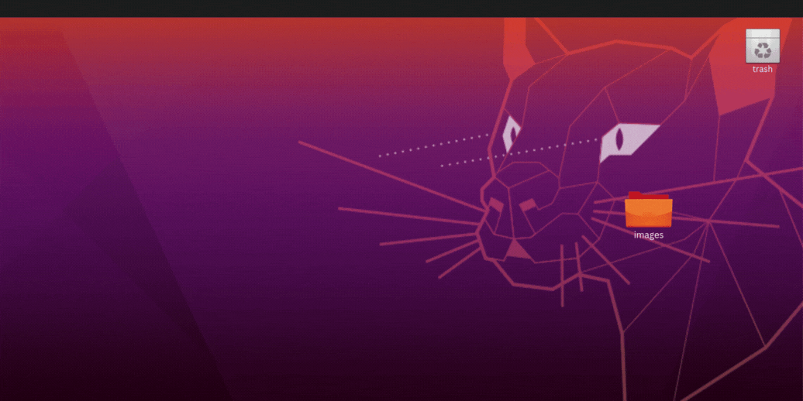

  

## ​​​ About Me  
- Frontend Web Developer from **Dallas, TX**  
- Interested in **AI + Machine Learning** and **UI/UX**
- *“live now think later”* - Tate McRae
- I ❤️ boba and labubus
- I'm a CERTIFIED Tater tot (ily tate) [**T8**]

---

##  Languages  

  <!-- Example: Using Simple Icons via GitHub raw URLs -->
  
  
  
  

---

*"But when can I hear the next one?"*
  </a>

