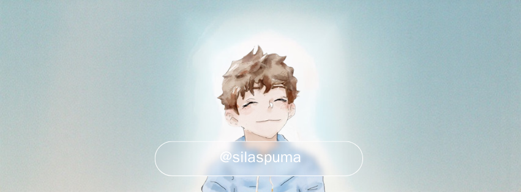

  

  
✪ 𝐟𝐨𝐮𝐧𝐝 𝐡𝐞𝐚𝐯𝐞𝐧 ✪

## ​​​ about me  
- *professional* vibe coder from **dallas, tx**  
- interested in **AI + Machine Learning** and **ui/ux**
- *“live now think later”* - tate mcrae
- i love boba and labubus
- im a tater tot, an EYEKON, and a conehead (**T8**) (**eat zucchini**) (**ㅅ**)

##  languages ik/am learning  

  <!-- html -->
  <picture>
    <source media="(prefers-color-scheme: dark)" srcset="icons/html5-light.svg">
    
  </picture>

  <!-- css -->
  <picture>
    <source media="(prefers-color-scheme: dark)" srcset="icons/css-light.svg">
    
  </picture>

  <!-- py -->
  <picture>
    <source media="(prefers-color-scheme: dark)" srcset="icons/python-light.svg">
    
  </picture>

  <!-- flutter -->
  <picture>
    <source media="(prefers-color-scheme: dark)" srcset="icons/typescript-light.svg">
    
  </picture>

---

*"but when can I hear the next one?"*
  </a>

